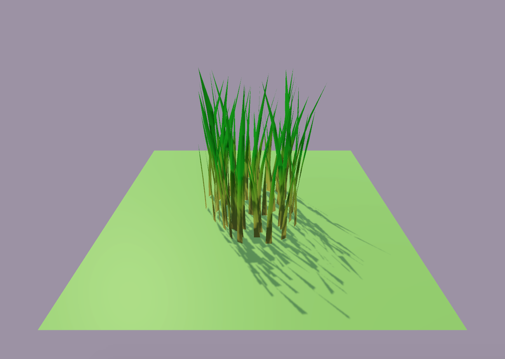
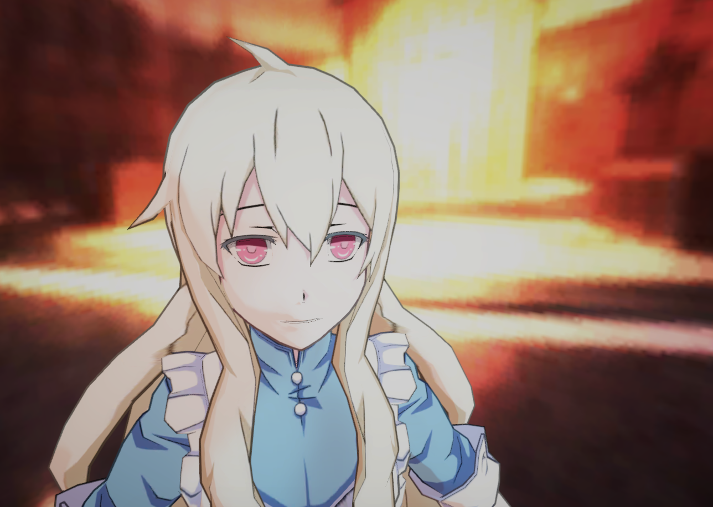

# URP_Collection_Tech
 一些URP实践用例、Tree、Grass、Cloud、Water And Soon。

Unity version : 2020.3 on master branch \
Tested with : Win DX11, Mac Metal
| Scene | Image | Description |
| --- | - | --- |
| `URP_ComputerShader_Tree` |  | Computer Shader Tree |
| `URP_GemotryShader_Tree` |  | Gemotry Shader Tree(Shader Targer 4.5,and not support osx&ios) |
| `URP_ToonLitShader` |  | Super Simple Toon Lit Shader |

-------------
References / Useful Links:
- [URP_GemotryShader](https://github.com/Cyanilux/URP_GrassGeometryShader)
- [URP_ToonLitShader](https://github.com/ColinLeung-NiloCat/UnityURPToonLitShaderExample)
